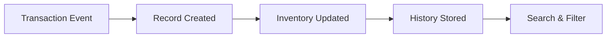

# Transaction History Overview

Track and analyze all inventory movements across your warehouses, stores, and customers. View transaction details, filter by various criteria, and monitor inventory flow in real-time.

## 🎯 **What is Transaction History?**

Transaction History provides a complete audit trail of all inventory movements in your Busiman system. Every check-in, check-out, internal transfer, and replacement is recorded with full details for complete visibility into your operations.

## 🏗️ **How Transaction History Works**

### Transaction Flow

### Key Features

| Feature                    | Description                                            | Access Level |
| -------------------------- | ------------------------------------------------------ | ------------ |
| **📊 Transaction Table**   | View all transactions in organized table format        | All Users    |
| **🔍 Advanced Filtering**  | Filter by type, warehouse, customer, date, and product | All Users    |
| **📱 Transaction Details** | Drill down into individual transaction information     | All Users    |
| **👥 Customer Inventory**  | View products currently held by customers              | All Users    |
| **📈 Real-time Metrics**   | Live counts of transaction types                       | All Users    |

## 🔄 **Transaction Types**

### Primary Transaction Categories

- **Check In** 🟢: Products returned to inventory (customer returns, service returns)
- **Check Out** 🔴: Products issued to customers (sales, service deployments)
- **Internal** 🔵: Store-to-store transfers within warehouses
- **Replacement** 🟠: Product exchanges (defective item replacements)

## 🖥️ **Main Interface**

### Transaction History Page

The main page displays transactions in a comprehensive table with:

- **Metrics Bar**: Quick overview of transaction volumes by type
- **Filter Controls**: Advanced filtering by multiple criteria
- **Date Range Selector**: Time-based filtering
- **Search Box**: Text search across products and serial numbers
- **Transaction Table**: Sortable columns with color-coded rows

### Transaction Details

Click any transaction row to view complete details including:

- **Transaction Header**: Sender, receiver, dates, and status
- **Product Information**: Complete product and serial number details
- **Transaction Flow**: Visual representation of movement
- **Additional Fields**: Custom fields and service information

## 🔍 **Filtering & Search**

### Filter Options

- **Transaction Type**: Check In, Check Out, Internal, Replacement
- **Warehouse**: Select specific warehouses
- **Store**: Filter by stores (when visible)
- **Customer**: Filter transactions for specific customers
- **Product**: Filter by specific products
- **Date Range**: Filter by transaction date range

### Text Search

Search across multiple fields simultaneously:

- Product names and aliases
- Serial numbers
- Customer names
- Reference numbers

## 👥 **Customer Inventory**

When filtering by customers, access the Customer Inventory modal to view:

- **Current Holdings**: Products currently with customers
- **Serial Numbers**: Individual item tracking
- **Search Within**: Find specific products or serials
- **Transaction Links**: View related transaction history

<!--  -->

> Complete transaction history interface with filtering and search capabilities

## 🚀 **Getting Started**

### Quick Start

1. **Navigate**: Go to Dashboard → Transaction History
2. **Apply Filters**: Use date range and transaction type filters
3. **Search**: Use text search for specific products or customers
4. **View Details**: Click any transaction for complete information
5. **Customer Inventory**: Access customer holdings when filtering by customers

### Best Practices

- **Use Date Ranges**: Always apply date limits for better performance
- **Combine Filters**: Multiple filters work together for precise results
- **Color Coding**: Pay attention to row colors for transaction types
- **Regular Monitoring**: Review transactions daily for operational insights

<!--  -->

> Step-by-step guide to filtering and searching transactions

## 💡 **Pro Tips**

- **Filter Strategically**: Start with date ranges, then add specific filters
- **Search Efficiency**: Use specific terms for faster, more accurate results
- **Customer Focus**: Use customer inventory modal for account management
- **Performance**: Limit date ranges for large datasets
- **Mobile Access**: All features work seamlessly on mobile devices

:::info Need Help?
Our support team is available **24/7** in Hindi and English. Contact us for assistance with transaction history navigation, filtering, or any questions about your inventory operations.
:::
